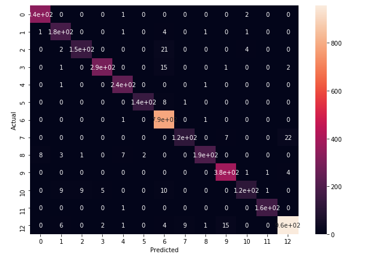

# Product Category Classification
#### Submission for IIITD MIDAS RA

The given dataset is obtained from flipkart, which is an online e-commerce giant and lists 20K products with the product name, product category tree, descriptions and other various fields. 

## Tasks

- Data Preprocessing
- Text to vector representation
- Model Selection and training
- Data Augmentation

## Data Preprocessing
----
On careful observation of dataset and after sorting, we can easily observe that there are many duplicate entries in this dataset. On dropping duplicate values, we found 3448 entries to be difficult. 
 
Now our next task is to identify cateogries in product category map. We choose the foremost term to be category for the product. 

Example: 
In ["Clothing >> Women's Clothing >> Fusion Wear>> ...], we choose "Clothing" as our major category. We eliminate all other categories.

Doing so leaves us with 260 unique categories. As evident from the given pie chart, only some categories have good number of examples. Number of examples in each label vary from as much as 5000 examples to as low as 1 examples. We observed that CLothing category has 5000 examples approx. which is very high compared to the remaining dataset. So, we decided to go one step further and divide clothing category into Men's clothing, Women's Clothing and Kid's Clothing.

We observed following distribution:
|   | Number of examples|
| ------------- | ------------- |
| Categories with less than 20 examples  | 238 |
| Categories with less than 200 examples  | 246  |
| Categories with less than 500 examples  | 253  |
| Categories with less than 800 examples  | 259 |
| Categories with less than 1000 examples  | 261 |
| Categories with less than 1000 examples  | 264 |
| Total Unique Categories  | 266 |

Hence, on observation, we created two datasets by dropping categories with 500 examples and cateogries with 200 examples. We will be working with both these datasets going on from here. Dropping categories below 500 examples leaves us with 13 unique categories. Dropping categories below 200 examples leaves us with 20 unique categories. 

It is also important to mention that while examples for each category range from 20.6% to 1% in case of our second dataset ie. in which we dropped categories with less than 200 examples, making it a bit imbalanced dataset. To solve this, we tried various **Data Augmentation Techniques** which are discussed later.

Moving on to the product description, following operations were carried on the text data: 
- converting text to lower case
- removing extra spaces, new line character and all other punctuation characters.
- tokenizing the strings to words and removing commonly occuring words like the, this etc..
- combining the words back to sentences

**Note**: Lemmatization and stemming was also an possibility but was not done.

## Text to vector representation and training
----
We used two ways to represent text as vectors:
- Using CountVectorizer from sklearn
- Training our own Word2Vec vocab using gensim

We can use other ways to do so too like training or using pre-trained word embeddings like **GLOVE, BERT, Word2Vec** for our text to vector representation but, they will be too complex for a dataset like this.

#### CountVectorizer with Naive Bayes
Count Vectorizer is based on frequency of the words occuring in the sentence. The size of a vector is equal to the vocab we are using as each word occuring has its on column in vector. We decided to use Naive bayes with count vector as CountVectorizer works with frequency and naive bayes works with probability of a word.
We got vocab of 17225 with our dataset\_500 and 19608 with our dataset\_200.

With dataset\_500, we got the following results:

As we can observe that, overall accuracy obtained for 13-class classification task is 95% and we have also obtained very good f1-scores with naive bayes, indicating that there wasn't much of dataset imabalance in this dataset. Also, for all the classes, we obtained precision over 90% except for one class for which precision is 89%, indicating good performance of the model.

With dataset\_200, we got the following results:

we can observe that, overall accuracy obtained for 20-class classification task is 91%. However, we can also see that, the f1-scores have fallen drastically, compared to the 13-class classification task indicating dataset imbalance in this dataset. 
We can address this problem using Data Augmentation.

#### Training our own Word2Vec vocab using gensim
We tried training our own vector embedding using word2vec from gensim and for dataset\_500, we obtained vocab of 17235 words and 19648 with dataset\_200. we trained our model for 30 epochs which took almost 2 minutes. We used feature vectors of size 300.

#### Preprocessing our data for LSTM's and CNN's
- we tokenized words using Keras preprocessing and use word2ec to convert them into vectors for our model
- we created embedding for our complete vocab using word2vec for our embedding layers in LSTM and CNN
- we encoded y labels using one hot encoding

#### Models used

We tried on 2 kind of layers: Bi-Directional LSTM's and CNN's for our model. LSTM model has 46,724 trainable params and CNN model has 235,540 trainable params. we compiled both our models using sparse_categorical_crossentropy loss function and adam optimizer. Maximum Epochs for both the models were set to 50 and Early stopping was used based on loss metric and patience of 3 epochs. Batch size of 64 was used for training.

## Results
#### Bi-Diectional LSTM
For dataset 500, Model using LSTM converged to  99.36% training accuracy and approx. 97.30% validation accuracy in just 28 epochs. On test set, this model performed as shown.

For dataset 200, Model using LSTM converged to 98.49% training accuracy and approx. 94.62% validation accuracy in 48 epochs. On test set, this model performed as shown.

#### CNN
For dataset 500, Model using CNN converged to  99.88% training accuracy and approx. 97.60% validation accuracy in just 18 epochs. On test set, this model performed as shown.

For dataset 200, Model using CNN converged to  99.67% training accuracy and approx. 95% validation accuracy in just 18 epochs. On test set, this model performed as shown.

## Data Augmentation

We have consistently mentioned dataset imbalance through out this summary and we tried various techniques to oersample the data to fix that.

- **Online tools for paraphasing**: we tried exporting data into text files and using online paraphrasing tools to generate similar descriptions for labels with low number of examples. This approach failed as all free tools for this purpose, had word limit and our dataset was huge.
- **Google Translate**: we tried translating descriptions into some random language and translating them back into english to get new examples. We used googleTrans API to do this, which worked fined for few examples but failed after 10 or 20 examples. This was because official Google API is paid and this was a work around. So, we couldn't use this process too.
- **Using NLTK to find synonyms**: we also tried using NLTK word net to obtain synonyms for random words in a description but, the results were not satisfactory.

Hence, we couldn't proceed with any of these techniques due to lack of resources, but they can surely work well to improve our model.
